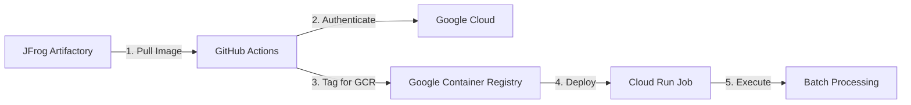

# 🚀 Complete Setup Guide: JFrog → Cloud Run Job Deployment

This guide provides all the steps needed to deploy your batch-processor Docker image from JFrog Artifactory to GCP Cloud Run Job.

## 📋 **Prerequisites Checklist**

- ✅ Docker image in JFrog Artifactory: `trial4jlj6w.jfrog.io/shirish-docker-docker-local/batch-processor:latest`
- ✅ GCP Project: `gifted-palace-468618-q5`
- ✅ Workload Identity Federation configured
- ⬜ Cloud Run Job infrastructure (we'll create this)
- ⬜ GitHub repository secrets configured

## 🎯 **Step-by-Step Setup**

### **Step 1: Add GitHub Secrets**

Go to `https://github.com/shirish36/batch-processor/settings/secrets/actions` and add these secrets:

| Secret Name | Value | Status |
|-------------|-------|--------|
| `JFROG_REGISTRY_URL` | `trial4jlj6w.jfrog.io` | ✅ Already added |
| `JFROG_USERNAME` | `[your-jfrog-username]` | ✅ Already added |
| `JFROG_PASSWORD` | `[your-jfrog-password]` | ✅ Already added |
| `GCP_PROJECT_ID` | `gifted-palace-468618-q5` | ⬜ **ADD THIS** |
| `GCP_REGION` | `us-central1` | ⬜ **ADD THIS** |
| `GCP_WORKLOAD_IDENTITY_PROVIDER` | `projects/283962084457/locations/global/workloadIdentityPools/github-pool/providers/github-provider` | ⬜ **ADD THIS** |
| `GCP_SERVICE_ACCOUNT` | `github-actions@gifted-palace-468618-q5.iam.gserviceaccount.com` | ⬜ **ADD THIS** |

### **Step 2: Create Cloud Run Job Infrastructure**

We'll create the infrastructure using gcloud commands (simpler than Terraform for this single resource):

#### **Option A: Using GitHub Actions (Recommended)**
I'll create a workflow that sets up the infrastructure automatically.

#### **Option B: Manual gcloud Commands**
```bash
# Enable required APIs
gcloud services enable run.googleapis.com
gcloud services enable cloudbuild.googleapis.com

# Create Cloud Run Job
gcloud run jobs create batch-processor-dev \
  --image="gcr.io/gifted-palace-468618-q5/batch-processor:latest" \
  --region="us-central1" \
  --max-retries=3 \
  --parallelism=1 \
  --cpu=1 \
  --memory=2Gi \
  --task-timeout=3600 \
  --service-account="github-actions@gifted-palace-468618-q5.iam.gserviceaccount.com"
```

### **Step 3: Deploy Your Image**

Use the GitHub Actions workflow:

1. Go to **Actions** tab in batch-processor repository
2. Select **"Deploy to GCP Cloud Run Job"**
3. Click **"Run workflow"**
4. Choose:
   - **Image tag**: `latest` (or specific tag)
   - **Environment**: `dev`

## 🔧 **Complete Workflow Process**



## 📝 **What Each Step Does**

### **1. Pull from JFrog** 🔄
```bash
docker pull trial4jlj6w.jfrog.io/shirish-docker-docker-local/batch-processor:latest
```

### **2. Authenticate to GCP** 🔐
```bash
# Uses Workload Identity Federation - no keys needed!
gcloud auth login --brief --cred-file=$GOOGLE_APPLICATION_CREDENTIALS
```

### **3. Tag for Google Container Registry** 🏷️
```bash
docker tag trial4jlj6w.jfrog.io/shirish-docker-docker-local/batch-processor:latest \
  gcr.io/gifted-palace-468618-q5/batch-processor:latest
```

### **4. Push to GCR** ⬆️
```bash
docker push gcr.io/gifted-palace-468618-q5/batch-processor:latest
```

### **5. Deploy to Cloud Run Job** 🚀
```bash
gcloud run jobs replace batch-processor-dev \
  --image="gcr.io/gifted-palace-468618-q5/batch-processor:latest" \
  --region="us-central1"
```

### **6. Execute Job (Optional)** ▶️
```bash
gcloud run jobs execute batch-processor-dev --region="us-central1"
```

## 🛠️ **Troubleshooting Guide**

### **Common Issues:**

#### **1. "Image not found in JFrog"**
- Verify image exists: Check JFrog web UI
- Check repository name: `shirish-docker-docker-local`
- Verify credentials: JFROG_USERNAME and JFROG_PASSWORD

#### **2. "GCP Authentication Failed"**
- Check Workload Identity Federation setup
- Verify service account permissions
- Ensure repository is allowed in WIF

#### **3. "Cloud Run Job Not Found"**
- Create the job first using Step 2
- Check region matches (us-central1)
- Verify project ID is correct

#### **4. "Permission Denied"**
- Service account needs these roles:
  - `roles/run.admin`
  - `roles/storage.admin`
  - `roles/iam.serviceAccountUser`

### **Debug Commands:**
```bash
# Check authentication
gcloud auth list

# Check available jobs
gcloud run jobs list --region=us-central1

# Check job details
gcloud run jobs describe batch-processor-dev --region=us-central1

# Check recent executions
gcloud run jobs executions list --job=batch-processor-dev --region=us-central1
```

## 🎯 **Quick Start Commands**

### **For Immediate Setup:**
```bash
# 1. Enable APIs
gcloud services enable run.googleapis.com cloudbuild.googleapis.com

# 2. Create initial job (will fail but creates structure)
gcloud run jobs create batch-processor-dev \
  --image="gcr.io/gifted-palace-468618-q5/batch-processor:placeholder" \
  --region="us-central1" \
  --service-account="github-actions@gifted-palace-468618-q5.iam.gserviceaccount.com"

# 3. Then use GitHub Actions to deploy real image
```

## 📊 **Monitoring and Logs**

### **GitHub Actions:**
- Monitor workflow progress in Actions tab
- Check each step: Pull → Tag → Push → Deploy

### **GCP Console:**
- **Jobs**: https://console.cloud.google.com/run/jobs?project=gifted-palace-468618-q5
- **Executions**: Click on job → View executions
- **Logs**: Click on execution → View logs

### **CLI Monitoring:**
```bash
# Watch job execution
gcloud run jobs executions describe EXECUTION-NAME \
  --region=us-central1 \
  --format="value(status.conditions[0].type)"

# Stream logs
gcloud logging read "resource.type=cloud_run_job" \
  --project=gifted-palace-468618-q5 \
  --limit=50
```

## ✅ **Success Indicators**

You'll know it's working when you see:
- ✅ **JFrog pull successful**
- ✅ **GCP authentication successful**  
- ✅ **Image pushed to GCR**
- ✅ **Cloud Run Job updated**
- ✅ **Job execution completed** (if testing)

## 🎉 **Final Checklist**

Before deployment:
- [ ] All 7 GitHub secrets added
- [ ] Cloud Run APIs enabled
- [ ] Initial Cloud Run Job created
- [ ] Workload Identity Federation working

For deployment:
- [ ] Choose correct image tag
- [ ] Select appropriate environment
- [ ] Monitor GitHub Actions workflow
- [ ] Check GCP Console for results

---

**🚀 Ready to deploy!** Follow Steps 1-2, then use the GitHub Actions workflow for automated deployment.
