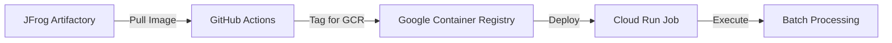

# 🚀 Deploy JFrog Image to GCP Cloud Run Job

This guide explains how to deploy your batch-processor Docker image from JFrog Artifactory to GCP Cloud Run Job.

## 🎯 **What This Does**

1. **🔄 Pull** - Gets your image from JFrog Artifactory
2. **🏷️ Tag** - Retags for Google Container Registry (GCR)
3. **📤 Push** - Pushes to GCR for GCP access
4. **🚀 Deploy** - Updates Cloud Run Job with new image
5. **🧪 Test** - Optional job execution test (dev environment only)

## 🔑 **Required GitHub Secrets**

Add these secrets to your **batch-processor repository**:

### **JFrog Secrets (Already configured)**
| Secret Name | Value | Status |
|-------------|-------|--------|
| `JFROG_REGISTRY_URL` | `trial4jlj6w.jfrog.io` | ✅ |
| `JFROG_USERNAME` | `[your-jfrog-username]` | ✅ |
| `JFROG_PASSWORD` | `[your-jfrog-password]` | ✅ |

### **GCP Secrets (Need to add)**
| Secret Name | Value | Example |
|-------------|-------|---------|
| `GCP_PROJECT_ID` | Your GCP project ID | `my-devops-project-123` |
| `GCP_REGION` | GCP region for deployment | `us-central1` |
| `GCP_WORKLOAD_IDENTITY_PROVIDER` | WIF provider resource name | `projects/123456789/locations/global/workloadIdentityPools/github-pool/providers/github-provider` |
| `GCP_SERVICE_ACCOUNT` | Service account email | `github-actions@my-project.iam.gserviceaccount.com` |

## 🔧 **How to Get GCP Secrets**

### **1. Get Project ID and Region**
```bash
# Get your project ID
gcloud config get-value project

# Get available regions
gcloud compute regions list
```

### **2. Get Workload Identity Federation Info**
```bash
# Get the provider resource name
gcloud iam workload-identity-pools providers list \
  --location="global" \
  --workload-identity-pool="github-pool"

# Get service account email
gcloud iam service-accounts list --filter="displayName:GitHub Actions"
```

## 🚀 **How to Deploy**

### **Method 1: Manual Deployment**
1. Go to Actions tab in this repository
2. Select "Deploy to GCP Cloud Run Job"
3. Click "Run workflow"
4. Choose:
   - **Image Tag**: `latest` or specific tag like `test-20250811-033649`
   - **Environment**: `dev`, `staging`, or `prod`

### **Method 2: Using Available Images**
Check your JFrog Artifactory for available tags:
```
trial4jlj6w.jfrog.io/shirish-docker-docker-local/batch-processor:latest
trial4jlj6w.jfrog.io/shirish-docker-docker-local/batch-processor:test-20250811-033649
```

## 📋 **Deployment Process**



## 🔍 **Monitoring Deployment**

### **GitHub Actions Logs**
- Check Actions tab for workflow progress
- Monitor each step: Pull → Tag → Push → Deploy

### **GCP Console**
- **Cloud Run Jobs**: https://console.cloud.google.com/run/jobs
- **Container Registry**: https://console.cloud.google.com/gcr/images
- **Job Executions**: Check individual job run logs

### **Verification Commands**
```bash
# Check job status
gcloud run jobs describe batch-processor-dev --region=us-central1

# List recent executions
gcloud run jobs executions list --job=batch-processor-dev --region=us-central1

# View execution logs
gcloud logging read "resource.type=cloud_run_job" --limit=50
```

## 🎛️ **Environment Configuration**

The deployment supports multiple environments:

- **dev**: Auto-executes job for testing
- **staging**: Deploys only (manual execution)
- **prod**: Deploys only (manual execution)

## 🔧 **Troubleshooting**

### **Common Issues**

1. **Image not found in JFrog**
   - Check image tag exists in JFrog Artifactory
   - Verify repository name: `shirish-docker-docker-local`

2. **GCP Authentication failed**
   - Verify WIF secrets are correct
   - Check service account permissions

3. **Cloud Run Job not found**
   - Ensure Terraform infrastructure is deployed
   - Verify job name format: `batch-processor-{environment}`

### **Debug Commands**
```bash
# Check available images in JFrog
# Login to JFrog web UI: trial4jlj6w.jfrog.io

# Check GCP authentication
gcloud auth list

# Check Cloud Run jobs
gcloud run jobs list --region=us-central1
```

## 🎉 **Success Indicators**

✅ **Image pulled from JFrog successfully**  
✅ **Image pushed to GCR successfully**  
✅ **Cloud Run Job updated successfully**  
✅ **Job execution completed (dev environment)**  

## 📚 **Next Steps**

1. **Add GCP secrets** to GitHub repository
2. **Run deployment workflow** manually
3. **Monitor logs** in GCP Console
4. **Set up scheduled execution** (optional)
5. **Configure monitoring/alerting** (optional)

---

**🚀 Ready to deploy!** Once you add the GCP secrets, you can deploy your JFrog image to Cloud Run Job with one click!
