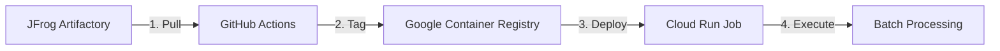

# 🚀 JFrog → GCR → Cloud Run Job Deployment

This workflow deploys your Docker image from JFrog Artifactory to Google Cloud Run Job via Google Container Registry.

## 🎯 **What This Workflow Does**



### **Complete Process:**
1. **🔐 Authenticate** - Both JFrog and GCP using secrets
2. **📥 Pull** - Your image from JFrog Artifactory  
3. **🏷️ Tag** - Image for Google Container Registry
4. **📤 Push** - Tagged image to GCR
5. **🚀 Update** - Cloud Run Job with new GCR image
6. **🧪 Test** - Execute job (dev environment only)

## 🔑 **Required GitHub Secrets**

Make sure these secrets are added to your repository:

| Secret Name | Value | Status |
|-------------|-------|--------|
| `JFROG_REGISTRY_URL` | `trial4jlj6w.jfrog.io` | ✅ |
| `JFROG_USERNAME` | `[your-jfrog-username]` | ✅ |
| `JFROG_PASSWORD` | `[your-jfrog-password]` | ✅ |
| `GCP_PROJECT_ID` | `gifted-palace-468618-q5` | ⬜ **ADD THIS** |
| `GCP_REGION` | `us-central1` | ⬜ **ADD THIS** |
| `GCP_WORKLOAD_IDENTITY_PROVIDER` | `projects/283962084457/locations/global/workloadIdentityPools/github-pool/providers/github-provider` | ⬜ **ADD THIS** |
| `GCP_SERVICE_ACCOUNT` | `github-actions@gifted-palace-468618-q5.iam.gserviceaccount.com` | ⬜ **ADD THIS** |

## 🚀 **How to Deploy**

### **Step 1: Go to Actions Tab**
Navigate to: `https://github.com/shirish36/batch-processor/actions`

### **Step 2: Select Workflow**
Click on **"Deploy JFrog Image to Cloud Run Job"**

### **Step 3: Run Workflow**
Click **"Run workflow"** and configure:

| Parameter | Description | Example |
|-----------|-------------|---------|
| **Image Tag** | JFrog image tag to deploy | `latest` or `test-20250811-033649` |
| **Environment** | Target environment | `dev`, `staging`, `prod` |
| **Force Rebuild** | Rebuild even if exists in GCR | `false` (default) |

### **Step 4: Monitor Progress**
Watch the workflow steps:
- ✅ Authenticate to JFrog and GCP
- ✅ Pull from JFrog
- ✅ Push to GCR  
- ✅ Update Cloud Run Job
- ✅ Test execution (dev only)

## 📋 **Workflow Features**

### **Smart Caching**
- Checks if image already exists in GCR
- Skips rebuild unless `force_rebuild` is true
- Saves time and bandwidth

### **Environment Support**
- **dev**: Auto-executes job for testing
- **staging**: Deploys only (manual execution)
- **prod**: Deploys only (manual execution)

### **Image Management**
- Tags with specific version: `gcr.io/project/batch-processor:test-20250811-033649`
- Also tags as latest: `gcr.io/project/batch-processor:latest`
- Environment variables injected into job

### **Error Handling**
- Validates image exists in JFrog before pulling
- Authenticates to both registries
- Cleans up local images after deployment

## 🔍 **Monitoring Deployment**

### **GitHub Actions Logs**
Monitor each step in the Actions tab:
1. Authentication success
2. Image pull/push progress  
3. Cloud Run Job update
4. Test execution results

### **GCP Console Links**
The workflow provides direct links to:
- **All Jobs**: https://console.cloud.google.com/run/jobs?project=gifted-palace-468618-q5
- **Specific Job**: Direct link to deployed job
- **Container Images**: View pushed images in GCR

### **CLI Monitoring**
```bash
# Check job status
gcloud run jobs describe batch-processor-dev --region=us-central1

# View recent executions  
gcloud run jobs executions list --job=batch-processor-dev --region=us-central1

# Stream logs
gcloud logging read "resource.type=cloud_run_job" --limit=50
```

## 🛠️ **Troubleshooting**

### **Common Issues:**

#### **"Image not found in JFrog"**
- Verify image tag exists: Check JFrog web UI
- Check repository name: `shirish-docker-docker-local`
- Verify JFrog credentials

#### **"GCP Authentication Failed"**  
- Check WIF provider configuration
- Verify service account permissions
- Ensure correct secret values

#### **"Permission Denied on GCR"**
- Service account needs `roles/storage.admin`
- Container Registry API must be enabled

#### **"Cloud Run Job Update Failed"**
- Job must exist (created by setup script)
- Service account needs `roles/run.admin`
- Check region matches (`us-central1`)

### **Debug Commands:**
```bash
# Test JFrog access
docker login trial4jlj6w.jfrog.io

# Test GCP access  
gcloud auth list
gcloud run jobs list --region=us-central1

# Check image in GCR
gcloud container images list --repository=gcr.io/gifted-palace-468618-q5
```

## 📊 **Deployment Examples**

### **Deploy Latest Image**
- **Image Tag**: `latest`
- **Environment**: `dev`
- **Force Rebuild**: `false`

### **Deploy Specific Version**
- **Image Tag**: `test-20250811-033649`  
- **Environment**: `staging`
- **Force Rebuild**: `false`

### **Force Rebuild**
- **Image Tag**: `latest`
- **Environment**: `prod`
- **Force Rebuild**: `true`

## ✅ **Success Indicators**

You'll know deployment succeeded when you see:
- ✅ **JFrog authentication successful**
- ✅ **Image pulled from JFrog**
- ✅ **Image pushed to GCR** 
- ✅ **Cloud Run Job updated**
- ✅ **Job execution completed** (dev environment)

## 🎉 **Ready to Deploy!**

1. **Add the 4 missing GCP secrets**
2. **Run the "Deploy JFrog Image to Cloud Run Job" workflow**
3. **Choose your image tag and environment**
4. **Monitor progress in Actions tab**

Your JFrog images will be automatically deployed to Cloud Run Job via GCR! 🚀
